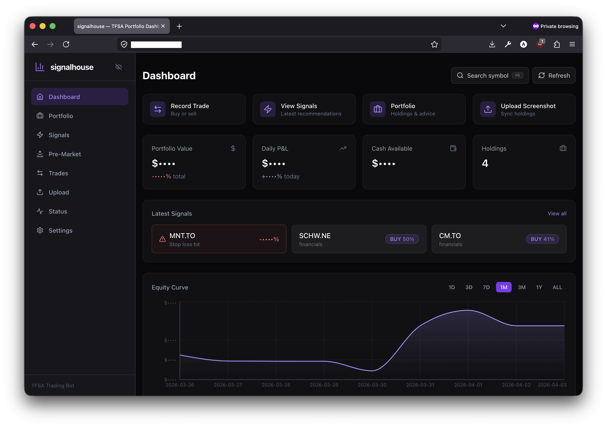
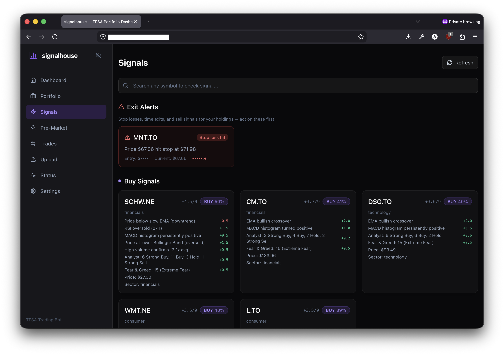
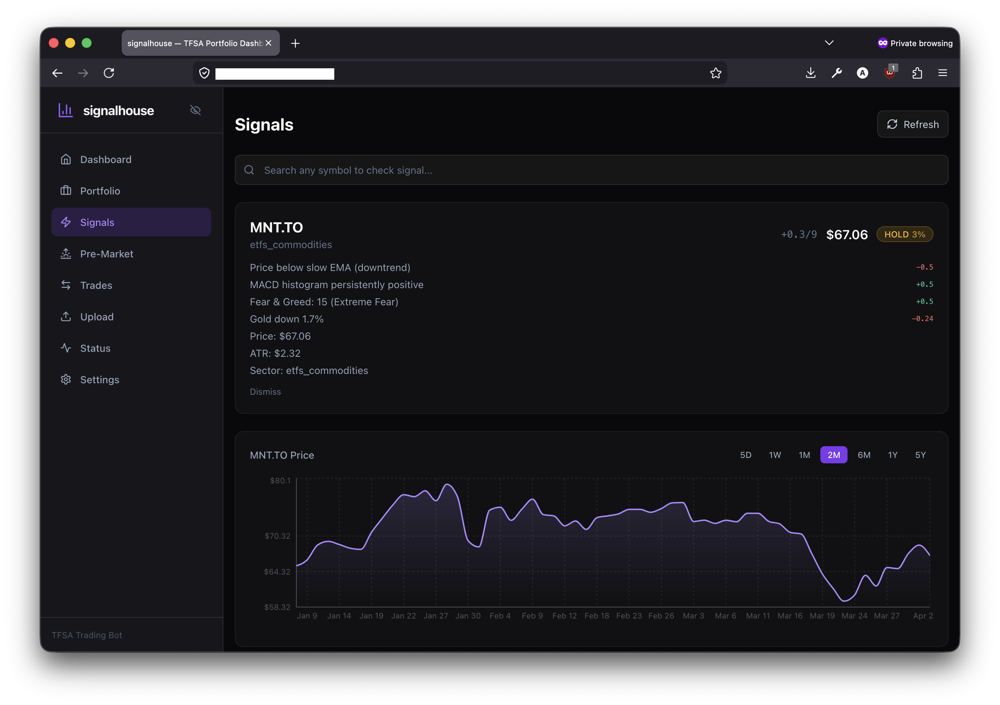
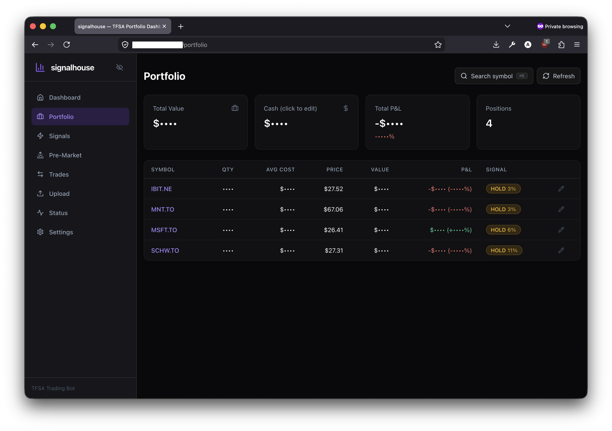
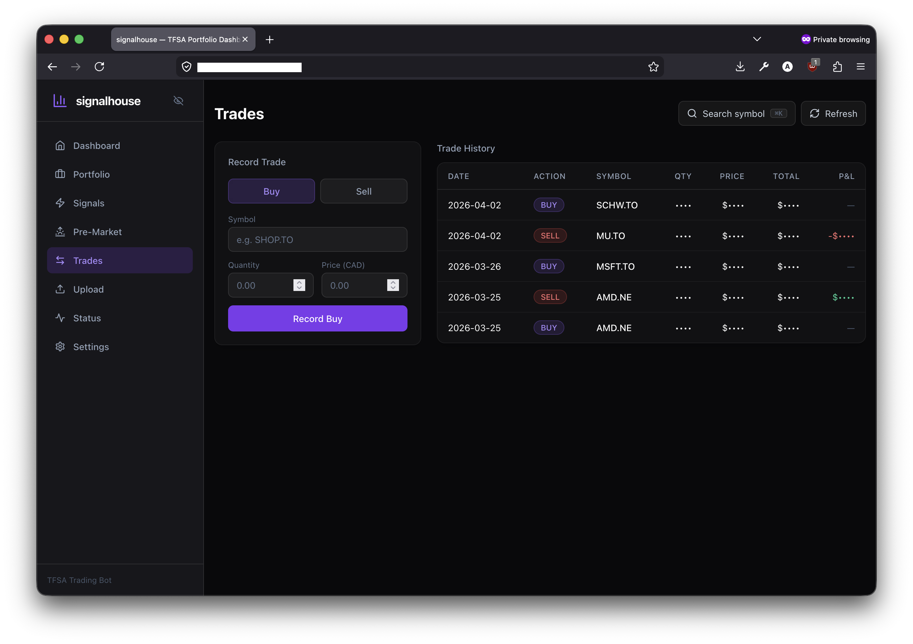
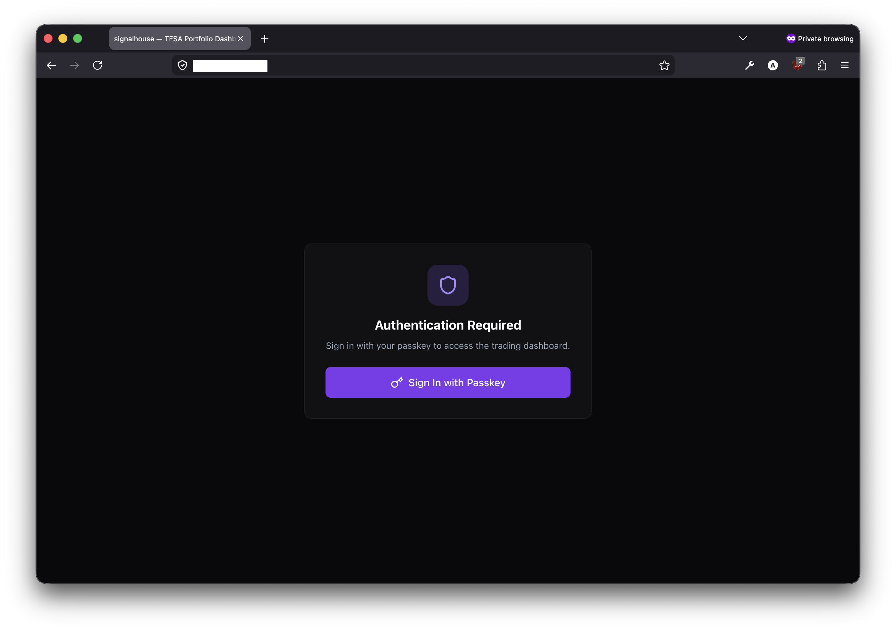

# signalhouse

Trading signal system for Canadian investors. Scans ~333 TSX stocks, CBOE Canada CDRs, and CAD-hedged ETFs every 15 minutes during market hours. Generates buy/sell recommendations using technical analysis, sentiment scoring, and commodity correlation.

**Not an auto-trader** — it tells you what to trade and why. You execute manually through your brokerage, then report back.

Built for Canadian TFSA accounts of any size, targeting safe aggressive growth.



## How It Works

Every 15 minutes during market hours, the system scores each of ~333 symbols on a **-9 to +9 scale** across three stages:

1. **Technical analysis** (max ±6) — EMA crossover, RSI, MACD, Bollinger Bands, volume confirmation via TA-Lib on 60 days of daily bars
2. **Sentiment adjustment** (max ±2) — analyst consensus, Fear & Greed Index (contrarian), news headline scoring
3. **Commodity correlation** (max ±1) — gold/oil/natgas/crypto futures adjust scores for correlated Canadian assets (gold miners track gold, oil producers track WTI, crypto ETFs follow BTC/ETH)

**Score ≥ +2 = BUY** &nbsp;&nbsp; **Score ≤ -2 = SELL** &nbsp;&nbsp; **Otherwise = HOLD**

Signals are delivered through push notifications (iOS), the web dashboard, and Discord.

## Screenshots

<table>
<tr>
<td width="50%">

**Signals — Exit alerts and buy recommendations with full score breakdowns**


</td>
<td width="50%">

**Signal Detail — Per-symbol analysis with price chart**


</td>
</tr>
<tr>
<td width="50%">

**Portfolio — Holdings, P&L, and per-position advice**


</td>
<td width="50%">

**Trades — Record buys and sells, view trade history**


</td>
</tr>
</table>

<details>
<summary>Passkey authentication</summary>



</details>

## Architecture

```
Internet -> Cloudflare (SSL) -> Caddy -> web (:3000)  pages
                                      -> api (:8000)  /api/*

Bot imports api as a Python package (no HTTP between them).
Web + iOS app communicate via REST API.
All services share one PostgreSQL database.
```

| Component | Stack |
|-----------|-------|
| **API** | FastAPI, SQLAlchemy async, asyncpg, TA-Lib |
| **Bot** | discord.py |
| **Web** | Next.js 14, Bun, Tailwind, Recharts |
| **App** | SwiftUI, Swift Charts, PushKit, CallKit |
| **DB** | PostgreSQL 16 |
| **Proxy** | Caddy |

## Features

### Signal Pipeline
- Six TA-Lib indicators (EMA, RSI, MACD, Bollinger, volume) scored into a composite signal
- Sentiment layer: analyst consensus per ticker, Fear & Greed contrarian index, news keyword scoring
- Commodity correlation: live futures data adjusts scores for sector-correlated Canadian equities
- Exit alerts for held positions: stop-loss hits, trailing stops, and swap-to-stronger suggestions
- **Action plan** with prioritized, position-sized trade instructions (sells → swaps → buys)
- **Signal snoozing** — temporarily silence sell signals (4h default), auto-unsnooze if loss worsens by 3%+
- Click any action to view inline price chart (web) or navigate to chart detail (iOS)

### Portfolio Tracking
- Record buys/sells via Discord, web, or iOS app
- Upload brokerage screenshots — Claude Vision (Anthropic API) auto-parses holdings
- Cash tracking, daily P&L, equity curve with snapshots
- Per-holding advice: HOLD, SELL, or SWAP with specific alternatives

### Risk Management
- ATR-based position sizing (2% risk per trade)
- Hard stops (5% below entry) and trailing stops (3% below peak)
- Circuit breakers: 8% daily drawdown or 20% total drawdown halts all signals
- Max 5 positions, 30% per position, 40% per sector

### Notifications
- **VoIP push** (CallKit) — strong signals (≥40% strength) bypass Do Not Disturb on iOS
- **Standard alerts** — pre-market movers (8 AM ET), morning briefing (8:30 AM), market close (3:50 PM), evening recap (10 PM PT)
- **Discord** — signal embeds, exit alerts, daily summaries
- Once-per-day dedup per symbol, re-sends only when strength changes

### Authentication
- Passkey/WebAuthn login — no passwords
- Single-user, JWT-gated API
- Cross-platform passkeys (web + iOS via Associated Domains)

### Privacy
- Toggle to mask portfolio-sensitive numbers (values, cash, P&L, quantities)
- Market data (prices, charts, signals) stays visible
- Persists in localStorage

## Getting Started

### Prerequisites

- Python 3.11+ with [TA-Lib](https://ta-lib.github.io/ta-lib-python/) (C library + Python wrapper)
- PostgreSQL 16
- [Bun](https://bun.sh) (web dashboard)
- Xcode 15+ (iOS app, optional)
- Docker & Docker Compose (deployment)

### Setup

```bash
cp .env.example .env
# Fill in: ANTHROPIC_API_KEY, POSTGRES_PASSWORD, JWT_SECRET
# Optional (only when running Discord bot profile):
# DISCORD_BOT_TOKEN, DISCORD_CHANNEL_ID, DISCORD_GUILD_ID
# Optional: APNS_KEY_ID, APNS_TEAM_ID, APNS_BUNDLE_ID (iOS push)
# Passkeys use DOMAIN as WebAuthn RP ID: set DOMAIN to your host
# (or DOMAIN=localhost for local self-hosting).
# Optional: DATABASE_URL to override the compose default connection string.
```

### Local Development

```bash
# API
cd api && pip install -e ".[dev]"
uvicorn trader_api.main:app --reload

# Bot
cd bot && pip install -e .
python -m trader_bot.main

# Web
cd web && bun install && bun run dev
```

### Docker (Production)

```bash
docker compose up -d --build    # postgres, api, bot, web, caddy
docker compose logs -f
```

Bot startup behavior is env-driven:
- If `DISCORD_BOT_TOKEN`, `DISCORD_CHANNEL_ID`, or `DISCORD_GUILD_ID` are missing, the bot container exits cleanly and does not block API/web.
- If those vars are set, the bot starts normally; if it later crashes, Docker restarts only the bot container and API/web keep running.
- Web startup port is env-driven via `WEB_PORT` (container listen port, default `3000`).

### Docker (Local / Self-Hosted)

For running on your own machine without a domain or Caddy — exposes API on `:8000` and web on `:3000` directly:

```bash
docker compose -f docker-compose.yml -f docker-compose.local.yml up -d --build
```

When `NEXT_PUBLIC_API_URL` is not set, the web dashboard defaults to `http://localhost:8000`. No extra configuration needed.
For local host port mapping, set `WEB_HOST_PORT` (defaults to `3000`) and optionally `WEB_PORT` if you also want the container/Caddy upstream port changed.

### iOS App

Open `app/Trader.xcodeproj` in Xcode. Configure API URL during onboarding. Requires an Apple Developer account for push notifications.

## Tech Stack

**Backend:** Python 3.11, FastAPI, SQLAlchemy (async), asyncpg, TA-Lib, yfinance, py-webauthn, PyJWT, httpx (HTTP/2 for APNs)

**Frontend:** Next.js 14, TypeScript, Tailwind CSS, Recharts, TanStack Query, Bun

**Mobile:** SwiftUI, Swift Charts, PushKit, CallKit, ASAuthorizationController (passkeys)

**Infrastructure:** PostgreSQL 16, Docker Compose, Caddy, Cloudflare

**AI:** Anthropic Claude Sonnet (vision API for brokerage screenshot parsing)

## Documentation

| Document | Description |
|----------|-------------|
| [ARCHITECTURE.md](docs/ARCHITECTURE.md) | System architecture, API endpoints, DB models, auth flow, Docker setup |
| [STRATEGY.md](docs/STRATEGY.md) | Signal pipeline deep-dive, scoring tables, risk parameters, symbol universe |
| [PLAN.md](docs/PLAN.md) | Development progress and roadmap |

## License

[MIT](LICENSE)
